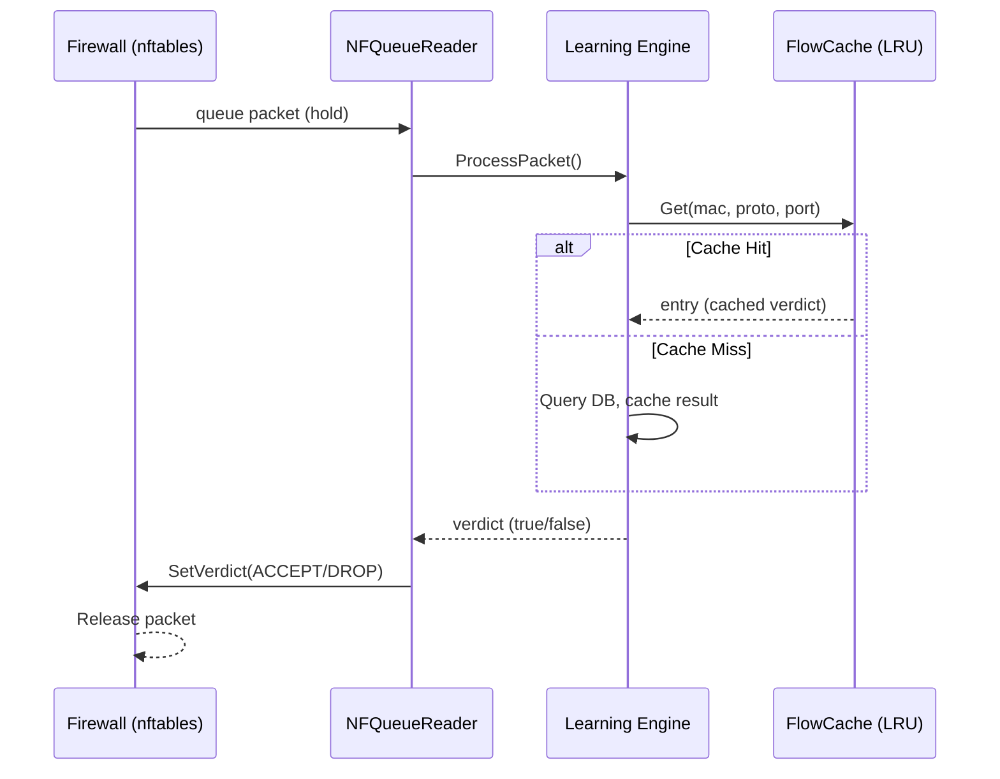

# Learning Engine First Packet Fix - Walkthrough

## Problem

The learning engine used `nflog` (async logging), causing a **first packet problem**:

```
Packet → Firewall (DROP) → nflog (copy to userspace) → Learning Engine
                ↑                                              ↓
         Already gone!                              Adds "Allow" rule
```

The first packet was dropped before the engine could add an allow rule.

---

## Solution: Dual-Mode Architecture

Added **nfqueue** (inline packet inspection) as an alternative to nflog:

```
                    ┌─────────────────────────────────────────┐
                    │ nflog (default) - async logging         │
  Packet → nftables │   └→ Log & continue, packet proceeds    │
                    ├─────────────────────────────────────────┤
                    │ nfqueue (inline_mode) - sync inspection │
                    │   └→ Hold packet, ask userspace, wait   │
                    │   └→ Return ACCEPT or DROP verdict      │
                    └─────────────────────────────────────────┘
```

---

## New Files

| File | Description |
|------|-------------|
| [nfqueue_linux.go](file:///Users/ben/projects/glacic/internal/ctlplane/nfqueue_linux.go) | Real nfqueue implementation with verdict callbacks |
| [nfqueue_stub.go](file:///Users/ben/projects/glacic/internal/ctlplane/nfqueue_stub.go) | Stub for non-Linux systems |

---

## Modified Files

| File | Changes |
|------|---------|
| [security.go](file:///Users/ben/projects/glacic/internal/config/security.go) | Added `InlineMode` config option |
| [server.go](file:///Users/ben/projects/glacic/internal/ctlplane/server.go) | Added conditional nfqueue reader, `startInlineLearning()` |
| [config.go](file:///Users/ben/projects/glacic/internal/firewall/config.go) | Added `RuleLearning` field |
| [script_builder.go](file:///Users/ben/projects/glacic/internal/firewall/script_builder.go) | Generate `queue num X bypass` when inline mode enabled |
| [service.go](file:///Users/ben/projects/glacic/internal/learning/service.go) | Added `Engine()` accessor for inline mode |

---

## How It Works

### 1. Configuration

```hcl
rule_learning {
  enabled = true
  learning_mode = true    # TOFU mode
  inline_mode = true      # NEW: Use nfqueue for first packet handling
  log_group = 100         # Queue number
}
```

### 2. Firewall Rule Generation

render_diffs(file:///Users/ben/projects/glacic/internal/firewall/script_builder.go)

When `inline_mode = true`:
```
queue num 100 bypass
```

When `inline_mode = false` (default):
```
log group 0 prefix "DROP_INPUT: " counter drop
```

### 3. Packet Flow (Inline Mode)



---

## Trade-offs

| Aspect | NFLog (default) | NFQueue (inline_mode) |
|--------|-----------------|----------------------|
| First packet | Lost | ✅ Preserved |
| Latency | Zero | ~microseconds |
| Throughput | Unlimited | Queue-limited |
| Failure mode | Packets proceed | `bypass` = fail-open |

---

## Test Results

```bash
$ go test ./internal/firewall/... ./internal/ctlplane/... ./internal/learning/...
ok      grimm.is/glacic/internal/firewall
ok      grimm.is/glacic/internal/ctlplane
FAIL    grimm.is/glacic/internal/learning  (TestParseSNI - pre-existing failure)
ok      grimm.is/glacic/internal/learning/flowdb
```

All new code passes. The `TestParseSNI` failure is a pre-existing, unrelated issue.

---

## Recommendations

1. **Enable inline mode only during initial learning phase**
2. **Disable after flows are learned** to avoid per-packet overhead
3. **Monitor queue stats** via `nfqueueReader.GetStats()` for overflow detection
